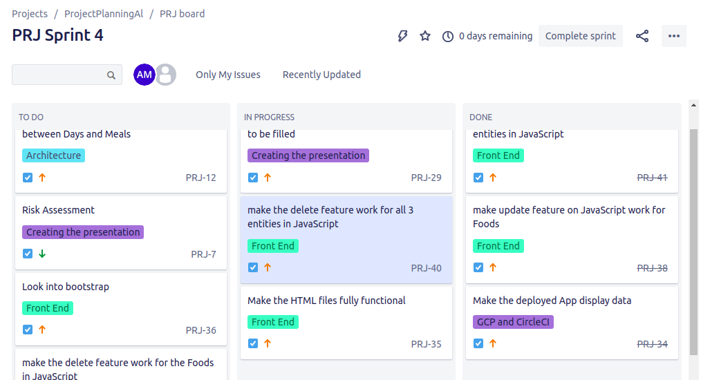

# Fundamental Project

### Meals Planning and Budgeting

## Content

## Brief
In short, this is tool that helps the user to plan and budget his/her favourite home-prepared meals on a weekly basis. The purpose is to help the user to know what he/she is eating. It will have the following features:
* a seven-day calendar in which to insert up to 5 meals a day
* the possibility of inserting a recipe and a description of the meal, as well as the ingredients, time to prepare, and health levels
* the possibility of saving and storing in the back log different recipes with the associated list of ingredients (major ingredients and minor ingredients)
* a calculation of the approximate cost of all the ingredients required so that we can know the cost of each recipe

More specifically, the application will have 3 databases:
* a **meal table** for which the user will specify for each of his favourite and most used dishes the following:
   * name of the recipe/dish
   * list of ingredients (high importance/low importance/spices) and associated estimated prices
   * description on the recipe/ notes that the user can make
   * time to prepare
   * other tags such as health rating or protein
* a **ingredient table**, in which we can plan which meal we are going to have and when
  * a seven-day calendar in which to insert up to 5 meals/dishes a day
  * possibility of saving data on previous weeks
* possibly a **budget table**, in which we will be able to track how much the meal will cost
  * a seven-day calendar in which we get a list of ingredients & cost used each day,
  * a calculation of the approximate cost of a meal, of a day and of a week of groceries
  * possibility of saving data on previous weeks

### Additional requirements
* It would be nice to have a feature of ideas for recipes with similar ingredients, connected to an API / "what to do with leftovers"
* Some meals will require half a unit of an ingredient (eg: half a can of tomato sauce) -> brainstorm ideas to monitor this and include it in the costs, such as for example an additional feature of the meals would be tracking the leftovers? or a tag that shows recipes we can make using the leftovers?
* Also think about the number of people that are going to eat (for the cost of ingredients) - 1 person/ 2 people/ a household

### Design

#### Project Tracking

In order to deliver a project following the Agile Methodology, I used a Kanban Board to monitor and track the evolution of my project. 

As part of the visualisation process, I created a backlog of tasks to do, that I grouped into different categories called "Epics". Examples of epics are "Front-End", "Architecture", "GCP and CircleCi" and "presentation". These tags were used to get an instant overview of which part of the project the task to be carried out related to.

For time management purposes, I created a new "Sprint" every one-two days, in which I could store all the tasks I wanted to complete during this timeframe, in order to keep track of my process.

#### Entity Relationship Diagram

The database for this application was designed using an entity relationship diagram, shown below. 

As is shown in the diagrams, my original plan was to create three entities Days, Meals and Foods, where Days and Meals would have a Many to Many relationship and Meals and Foods would also have a Many to Many relationship. Unfortunately, the development of this idea would've required more time and expertise which is why I decided at this stage to keep only two entities, Meals and Foods, having a One to Many relationship. 

### Creation

#### Architecture
#### Back-end
#### Front-end
#### Database structrure
#### Systems Integration and Build
#### Cloud Server

## Architecture

### Database structure

### CI Pipeline

### Stage View

## Project Tracking

### Risk Assessement

### Future improvements
Google docs file linked to this with different potential risks, impacts and predicted level of occurrence

I would like to further develop the budgetting aspect of this app.

Implement a feature in which we can for 1 person how much of the unit of the ingredient is being used (eg: for a homemade soup, half a pack of frozen spinach is going to be used)
Implement a feature in which we can specify how many people are eating a meal, so we can specify how many portions of food to have (for the cost of ingredients) (eg: 1 person/ 2 people/ a household)
Implement an API that will essemtially get the price of ingredients automatically on a website (eg: on Sainsbury's website)
I would also like to change the way the Calendar page to a seven day calendar with the appropriate dates, be able to save previous weeks.

Finally, I would like to change the @OneToMany relationships between Days and Meals and Meals and Foods to @ManyToMany relationships, so that we could easily assign ingredients that have been placed into one meal more easily (and similarly with meals in days).
